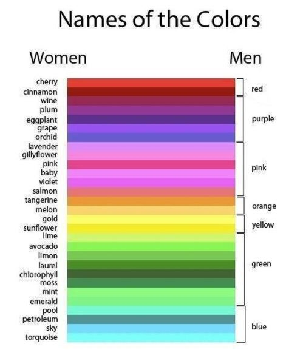

# Practice projects for Lesson 5

## Control structures

### 1. Color converter
- **Difficulty: 2/5**
- **Creativity: 0/5**
- **Research need: 0/5** \
Mens do not see the colors the same way as womens: Womens are able to see more shades of a color.
You have to write a program, that gets colors from the standard input (console) as the women sees, and you print out the corresponding "men-color".

#### Your tasks
- You shall read words from console until the user types "quit"!
- Write a function, that converts the women-color to men-color according to the given table!
  - the other direction is not feasible, you shall write only women to men.
- Print out the name of the color as mens see it.
- Write an exception class, that is thrown when there is no record found in the table.
  - This exception must be handled correctly and user-friendly: the Exception message shall be filled out, and the user shall get a normal error message, not a StackTrace.
  - This exception is thrown by your converter-function, and handled in the function where you reads from the user.
  - The program shall continue the operation until "quit" commend, even if exception is thrown.
- You have to use the best available control structures for all subtasks, otherwise the homework will be rejected! 
